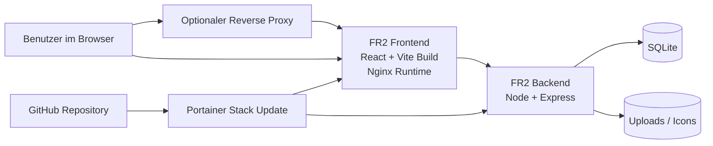

<p align="center">
   
</p>

<p align="center">
   <strong>Ein modernes internes Dashboard für Firmen-VMs, Tools, Favoriten und Admin-Workflows.</strong>
</p>

<p align="center">
   React, Vite, TypeScript, Express, SQLite, Nginx und Podman oder Portainer in einem fokussierten Stack.
</p>

<p align="center">
   
   
   
   
   
   
   
</p>

<p align="center">
   <a href="#highlights">Highlights</a> •
   <a href="#architektur">Architektur</a> •
   <a href="#portainer-deployment-aus-github">Portainer Deploy</a> •
   <a href="#lokale-installation-auf-der-vm">Lokale Installation</a> •
   <a href="#betrieb-und-wartung">Betrieb</a>
</p>

---

## Überblick

FR2 AppLauncher ist eine interne Dashboard-Anwendung für Firmen-VMs und Team-Links. Die App kombiniert einen visuellen Launcher mit Admin-Funktionen, Import- und Export-Workflows, Favoriten, Release-Hinweisen und einem Betriebsmodell, das bewusst einfach gehalten ist.

Der Fokus ist nicht auf einem generischen Admin-Template, sondern auf einem eigenständigen, produktiven Tool:

- Frontend öffentlich erreichbar über einen festen Host-Port oder Reverse Proxy
- Backend nur intern im Compose-Netz sichtbar
- persistente Datenhaltung für Datenbank und Uploads
- Updates über GitHub und Portainer ohne Reset der App-Daten
- lokale Installation per Shell-Skript für schnelle VM-Setups

## Preview

<p align="center">
   
</p>

## Highlights

- Zentrale Link- und Gruppenverwaltung für interne Anwendungen, Tools und Umgebungen
- Drag-and-drop für Gruppen und Links direkt im Dashboard
- Favoritenbereich für schnellen Zugriff auf häufig genutzte Ziele
- Admin-Modus mit Edit-Workflow, Login, Import, Icon-Verwaltung und Release-Hinweisen
- Bookmark-Import und Export für schnelleren Datenumzug
- Upload eigener Icons inklusive Verwaltung und Löschfunktion
- Release-Hinweis-Dialog mit manueller Historie und automatischer Build-Version
- Podman- und Portainer-freundliches Deployment-Modell für einfache Updates

## Tech Stack

| Bereich | Technologie |
| --- | --- |
| Frontend | React 19, Vite 7, TypeScript, Zustand, React Query |
| UI | Tailwind, Radix UI, Lucide, dnd-kit |
| Backend | Node.js 22, Express, TypeScript |
| Daten | SQLite |
| Auslieferung | Nginx |
| Betrieb | Podman, Portainer, Compose |

## Architektur



## Standard-Betriebsmodell

- Frontend-Port standardmäßig `9020`
- Backend-Port nur intern im Compose-Netz `3000`
- kein öffentliches Backend-Port-Mapping
- HTTP im internen Netz, kein HTTPS-Zwang im Standardbetrieb
- Frontend zusätzlich im externen Proxy-Netz `nginx-proxy-manager_default`
- persistente Volumes für Datenbank und Uploads
- Frontend startet unabhängig vom Backend, damit Webzugriff nicht vom Healthcheck blockiert wird

## Portainer Deployment aus GitHub

Ja, der Stack kann direkt aus dem GitHub-Repository in Portainer deployed werden.

Für einen absichtlich sicheren Start müssen in Portainer mindestens diese Variablen gesetzt sein:

- `JWT_SECRET`
- `ADMIN_PASSWORD`

Ohne diese beiden Werte startet der Stack nicht.

### Empfohlene Portainer-Konfiguration

1. In Portainer `Stacks` öffnen.
2. `Add stack` auswählen.
3. `Repository` oder `Git Repository` als Deployment-Typ wählen.
4. Repository-URL eintragen.
5. Als Compose-Datei `docker-compose.yml` verwenden.
6. Unter `Environment variables` mindestens diese Werte setzen:
    - `JWT_SECRET`
    - `ADMIN_PASSWORD`
7. Stack deployen.

### Optionale Environment-Variablen

| Variable | Zweck | Standard |
| --- | --- | --- |
| `FRONTEND_PORT` | Host-Port für das Frontend | `9020` |
| `DATABASE_PATH` | SQLite-Datei im Container | `/app/data/applauncher.db` |
| `PROXY_NETWORK` | Externes Netzwerk für Nginx Proxy Manager | `nginx-proxy-manager_default` |
| `FRONTEND_URL` | zusätzliche erlaubte Origins, kommagetrennt | leer |
| `COOKIE_SECURE` | nur bei HTTPS auf `true` setzen | `false` |

### Hinweise zum Proxy-Betrieb

- `FRONTEND_URL` ist für den Standardbetrieb über denselben Host meist nicht nötig.
- Die App akzeptiert denselben Origin hinter dem Proxy automatisch.
- Für Nginx Proxy Manager gibt es jetzt beide Wege: entweder Proxy-Ziel auf `VM-HOSTNAME:9020` oder gemeinsames Netzwerk über `PROXY_NETWORK`.
- Der direkte Zugriff über `http://VM-HOSTNAME:9020` muss auch dann funktionieren, wenn das Backend gerade noch startet.

## Zugriff

Nach dem Deploy ist die App standardmäßig hier erreichbar:

- `http://VM-HOSTNAME:9020`

Der Admin-Login erfolgt über das Schloss-Symbol im Dashboard.

## Updates über Portainer

Im Regelfall reichen für Updates diese Schritte:

1. Änderungen nach GitHub pushen.
2. Den bestehenden Stack in Portainer öffnen.
3. `Update` oder `Pull and redeploy` ausführen.

Die App-Daten bleiben erhalten, solange der bestehende Stack weiterverwendet wird, weil Datenbank und Uploads persistent gemountet sind.

## Lokale Installation auf der VM

Wenn du die App direkt auf einer VM ohne Portainer deployen willst:

```bash
git clone <repo-url>
cd FR2-AppLauncher
bash install.sh
```

Das Installationsskript erledigt automatisch:

- Prüfung auf `podman` und `podman-compose` oder `podman compose`
- Erstellung einer lokalen `.env`
- Generierung eines sicheren `JWT_SECRET`
- Abfrage oder Generierung eines Admin-Passworts
- Anlage von `data/` und `uploads/icons/`
- Prüfung und Erstellung des Proxy-Netzwerks
- Build und Start des Stacks

## Lokale Entwicklung

Empfohlen ist Node.js 22 LTS. Die App verwendet den eingebauten SQLite-Treiber aus Node und ist auf eine aktuelle LTS-Version ausgelegt.

Im Projektstamm:

```bash
npm install
npm run dev
```

Das Root-Projekt verwendet npm Workspaces und installiert damit Root-, Backend- und Frontend-Abhängigkeiten.

`npm run dev` startet:

- das Backend im Watch-Modus
- das Frontend mit Vite

Für die lokale Entwicklung werden automatisch diese Defaults gesetzt:

- `JWT_SECRET=CHANGE_ME_DEV_SECRET`
- `ADMIN_PASSWORD=1234`
- `ALLOW_INSECURE_DEFAULTS=true`

Für produktive Deployments brauchst du weiterhin echte, eigene Werte.

### Nützliche Root-Befehle

```bash
npm run build
npm run test
npm run lint
```

## Empfohlene `.env`

Für den Standardbetrieb auf einer VM ohne Sonderfälle brauchst du genau diese Werte:

```env
PORT=3000
FRONTEND_PORT=9020
DATABASE_PATH=/app/data/applauncher.db
PROXY_NETWORK=nginx-proxy-manager_default
FRONTEND_URL=
COOKIE_SECURE=false
ALLOW_INSECURE_DEFAULTS=false
JWT_SECRET=9d8f0e6a1c2b3d4e5f60718293a4b5c6d7e8f90123456789abcdef012345678
ADMIN_PASSWORD=ChangeThisToYourOwnStrongPassword
```

Wichtig:

- `JWT_SECRET` darf nicht leer sein und sollte mindestens 32 Zeichen lang sein.
- `ADMIN_PASSWORD` darf nicht leer sein. Klartext ist erlaubt, ein bcrypt-Hash ebenfalls.
- `FRONTEND_URL` im Standardfall leer lassen. Nur setzen, wenn du bewusst zusätzliche Origins erlauben willst.
- `COOKIE_SECURE=false` ist für direkten HTTP-Zugriff gedacht. Hinter einem HTTPS-Reverse-Proxy kann die App HTTPS normalerweise automatisch erkennen; falls dein Proxy `X-Forwarded-Proto` nicht korrekt weiterreicht, setze `COOKIE_SECURE=true` explizit.

Wenn du `install.sh` verwendest, gilt zusätzlich:

- Existiert bereits eine `.env`, dann wird sie wiederverwendet.
- Eine vorhandene `.env` mit leerem `JWT_SECRET` oder leerem `ADMIN_PASSWORD` blockiert die Installation.
- Wenn du neu starten willst, lösche die bestehende `.env` vor `bash install.sh`.

`ADMIN_PASSWORD` kann als Klartext gesetzt werden. Ein vorhandener bcrypt-Hash wird ebenfalls unterstützt.

## Betrieb und Wartung

### Stack starten oder aktualisieren

```bash
podman compose up -d --build
```

### Stack stoppen

```bash
podman compose down
```

### Logs ansehen

```bash
podman compose logs -f
```

### Backup erstellen

```bash
./backup.sh
```

### Backup wiederherstellen

```bash
./restore.sh <path_to_backup.tar.gz>
```

Das Restore-Skript stoppt vorher den Stack und überschreibt die bestehenden `data/`- und `uploads/`-Verzeichnisse.

## Projektstruktur

```text
.
├── backend/                 # Express API, DB, Auth, Uploads, Routen
├── frontend/                # React App, Dashboard, Admin UI, Assets
├── docker/                  # Entrypoints für Frontend und Backend
├── nginx/                   # Nginx-Konfiguration
├── uploads/                 # persistente Uploads außerhalb des Containers
├── install.sh               # VM-Installationsskript
├── backup.sh                # Backup von Daten und Uploads
├── restore.sh               # Restore aus Backup-Archiv
├── docker-compose.yml       # Stack-Definition
├── Dockerfile.frontend      # Frontend-Build und Nginx-Runtime
└── Dockerfile.backend       # Backend-Container
```

## Release- und Versionslogik

- die Hauptversion wird bewusst manuell gepflegt
- größere inhaltliche Releases landen in der Versionshistorie
- die sichtbare Build-Version kann bei Builds automatisch weiterlaufen
- Release-Hinweise bleiben absichtlich kontrolliert und nicht blind aus Commit-Messages generiert

## Wichtige Hinweise

- Keine echten Secrets ins Repository committen.
- `JWT_SECRET` und `ADMIN_PASSWORD` immer pro Umgebung separat setzen.
- Das Backend ist absichtlich nicht direkt von außen erreichbar.
- `COOKIE_SECURE=true` erst aktivieren, wenn die App tatsächlich über HTTPS ausgeliefert wird.
- Für Reverse-Proxy-Setups muss das Frontend im passenden externen Netzwerk hängen.

## Warum dieses Repo nicht wie ein Standard-Template wirkt

Die App ist nicht als beliebiges CRUD-Panel gedacht, sondern als internes Produkt mit eigener visueller Sprache. Header, Dock, Favoriten, Admin-Modus, Icon-Management und Release-Dialog sind gezielt auf einen täglichen internen Einsatz ausgelegt.

Wenn du das Repo jemandem zeigst, soll es nicht wie ein schnell zusammengeklebtes Vite-Gerüst wirken, sondern wie ein bewusst gebautes, betreibbares Produkt.

---

<p align="center">
   
</p>

<p align="center">
   <strong>FR2 AppLauncher</strong><br/>
   Interne Dashboards sauber deployen, einfach aktualisieren und produktiv betreiben.
</p>
